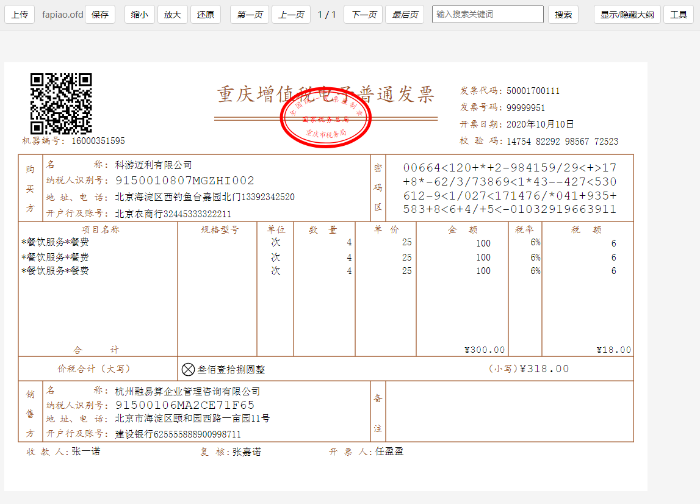

# LiteOfd 类方法说明文档

版本：0.4.0

## 1. 简介

LiteOfd 是一个用于处理 OFD（Open Fixed-layout Document）文件的轻量级库。它提供了解析、渲染和操作 OFD 文档的功能，使开发者能够在 Web 应用中轻松展示和操作 OFD 文档。支持Canvas和SVG双渲染模式，提供丰富的配置选项和优化功能。<br>

## 在线演示

🔗 **Demo**: [https://signitdoc.github.io/liteofd/](https://signitdoc.github.io/liteofd/)

## 1.1 示例图片

以下是一个OFD文档渲染的示例图片:


文档渲染

发票渲染

该图片展示了使用LiteOfd库渲染OFD文档的效果。您可以看到文档内容被准确地呈现,包括文本、图形和布局等元素。

## 1.2 基础使用示例
使用npm安装
```bash
npm install liteofd
```

`注意：目前打包遇到问题，发布到npm之后字体文件因为无法正确加载导致渲染字体可能出现问题，所以建议源码引入。另外如果有人愿意贡献打包脚本，可以联系我。QQ：897761547，谢谢！或者帮忙修改打包脚本，提PR。`

步骤是将OFD文档解析之后调用渲染方法，然后将渲染结果添加到显示组件中
```typescript
import { LiteOfd } from 'liteofd'

function parseOfdFile(file: File) {
  const liteOfd = new LiteOfd()
  let appContent = getElementById("ofd-content")
  appContent.innerHTML = ''
  liteOfd.parse(file).then((data: OfdDocument) => {
    console.log('解析OFD文件成功:', data);
    let ofdDiv = liteOfd.render(undefined, 'background-color: white; margin-top: 12px;')
    appContent.appendChild(ofdDiv)
  }).catch((error) => {
    console.error('解析OFD文件失败:', error);
  });
}
```

## 2. 使用方法

### 2.1 async parse(file: string | File | ArrayBuffer): Promise<OfdDocument>

描述：解析上传的 OFD 文件。

参数：
- file: File - 用户上传的 OFD 文件对象

返回值：
- Promise<OfdDocument>：一个 Promise，解析成功后返回 OfdDocument 对象

示例：
```typescript
const fileInput = document.getElementById('fileInput') as HTMLInputElement;
const file = fileInput.files?.[0];
if (file) {
  liteOfd.parse(file).then((data: OfdDocument) => {
    console.log('解析OFD文件成功:', data);
  }).catch((error) => {
    console.error('解析OFD文件失败:', error);
  });
}
```

### 2.2 render(container?: HTMLDivElement, pageWrapStyle?: string, pageIndexes?: number[]): HTMLDivElement

描述：渲染 OFD 文档。

参数：
- container: HTMLDivElement - 可选的自定义容器
- pageWrapStyle: string - 可选的页面包装样式
- pageIndexes: number[] - 指定渲染的页面索引数组，可选

返回值：
- HTMLDivElement：渲染后的 div 元素

示例：
```typescript
let renderDiv = liteOfd.render(undefined, 'background-color: white; margin-top: 12px;')
document.getElementById('content').appendChild(renderDiv);

// 只渲染指定页面
let renderDiv = liteOfd.render(undefined, 'background-color: white;', [1, 2, 3])
```

### 2.3 renderPage(pageIndex: number, pageWrapStyle?: string): HTMLDivElement

描述：渲染指定页面。

参数：
- pageIndex: number - 页面索引
- pageWrapStyle: string - 可选的页面样式

返回值：
- HTMLDivElement：渲染后的页面元素

示例：
```typescript
let pageDiv = liteOfd.renderPage(1, 'background-color: white;')
```

### 2.4 配置相关方法

#### toggleRenderTextLayer(renderTextLayer: boolean)
描述：控制是否渲染文本选择层。

#### showConfigUI(container?: HTMLElement)
描述：显示配置界面。

#### hideConfigUI()
描述：隐藏配置界面。

#### toggleConfigUI()
描述：切换配置界面显示状态。

#### getConfigManager(): ConfigManager
描述：获取配置管理器实例。

### 2.5 导航和缩放

#### nextPage()
描述：跳转到下一页。

#### prevPage()
描述：跳转到上一页。

#### gotoPage(pageIndex: number)
描述：跳转到指定页面。

#### zoomIn(step: number = 0.1)
描述：放大文档。

#### zoomOut(step: number = 0.1)
描述：缩小文档。

#### resetZoom()
描述：重置缩放比例。

### 2.6 内容操作

#### getContent(page?: number): string
描述：获取指定页面或全文的文本内容。

#### search(keyword: string)
描述：搜索文档内容。

#### executeAction(action: XmlData)
描述：执行指定的动作。

## 3. 配置系统

### 3.1 全局配置选项

```typescript
interface GlobalConfig {
  debug: {
    drawTextBoundaryBox: boolean;
    drawPathBoundaryBox: boolean;
    drawImageBoundaryBox: boolean;
    logCTMTransform: boolean;
    logTextRendering: boolean;
    logFontLoading: boolean;
    showFPS: boolean;
  };
  rendering: {
    enableAntialiasing: boolean;
    textRenderingOptimization: boolean;
    fontCacheSize: number;
    maxCanvasSize: number;
  };
  performance: {
    enableLazyLoading: boolean;
    enablePageCaching: boolean;
    maxCachedPages: number;
  };
  features: {
    enableZoom: boolean;
    enablePan: boolean;
    enableTextSelection: boolean;
    enableAnnotation: boolean;
  };
  renderPages?: number[];
}
```

### 3.2 渲染器配置

支持Canvas和SVG两种渲染模式：

```typescript
// 设置渲染器类型
rendererConfig.setRendererType('canvas'); // 或 'svg'

// 检查当前渲染器类型
const isCanvas = rendererConfig.isCanvasRender();
const isSvg = rendererConfig.isSvgRender();
```

## 4. 事件系统

### 4.1 ofdPageChange 事件
描述：当 OFD 文档页面发生变化时触发。

```typescript
window.addEventListener('ofdPageChange', (event: CustomEvent) => {
  const { pageIndex, pageId } = event.detail;
  // 更新页面信息显示
  updatePageInfo();
});
```

### 4.2 signature-element-click 事件
描述：当点击签名元素时触发。

```typescript
appContent.addEventListener('signature-element-click', (event: CustomEvent) => {
  const { nodeData, sealObject, boundaryBox } = event.detail;
  console.log('Clicked Signature Element:', nodeData);
  console.log('Seal Object:', sealObject);
  // 显示签名详情
  displaySignatureDetails(nodeData, sealObject);
});
```

## 5. 注意事项

- 在使用 LiteOfd 类的方法之前，请确保已经成功解析了 OFD 文件。
- 某些方法（如 nextPage、prevPage 等）可能会触发 ofdPageChange 事件，请根据需要添加相应的事件监听器。
- 对于大型 OFD 文件，解析和渲染可能需要一些时间，建议添加适当的加载提示。
- 使用配置系统可以优化渲染性能和内存使用。
- 选择合适的渲染器（Canvas/SVG）可以在不同场景下获得最佳性能。

## Star
[](https://starchart.cc/xxss0903/liteofd)
