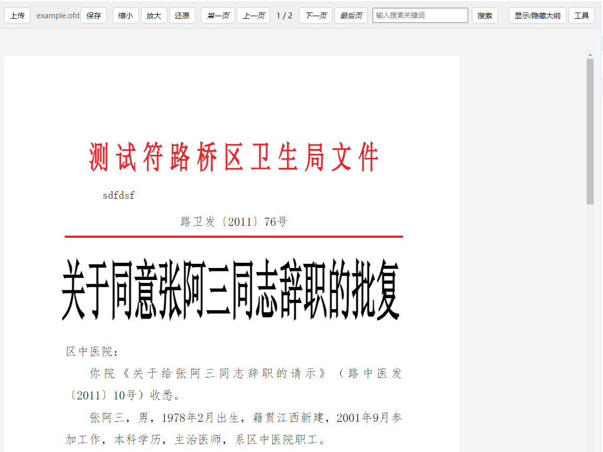

# LiteOfd 类方法说明文档

版本：0.2.5

## 1. 简介

LiteOfd 是一个用于处理 OFD（Open Fixed-layout Document）文件的轻量级库。它提供了解析、渲染和操作 OFD 文档的功能，使开发者能够在 Web 应用中轻松展示和操作 OFD 文档。<br>

在线预览地址：[https://signitdoc.github.io/liteofd/](https://signitdoc.github.io/liteofd/)

## 1.1示例图片

以下是一个OFD文档渲染的示例图片:


文档渲染

发票渲染

该图片展示了使用LiteOfd库渲染OFD文档的效果。您可以看到文档内容被准确地呈现,包括文本、图形和布局等元素。

## 1.2 基础使用示例
使用npm安装
```bash
npm install liteofd
```

`注意：目前打包遇到问题，发布到npm之后字体文件因为无法正确加载导致渲染字体可能出现问题，所以建议源码引入。另外如果有人愿意贡献打包脚本，可以联系我。QQ：897761547，谢谢！或者帮忙修改打包脚本，提PR。`

步骤是将OFD文档解析之后调用渲染方法，然后将渲染结果添加到显示组件中
```Typescript
import { LiteOfd } from 'liteofd'

function parseOfdFile(file: File) {
  const liteOfd = new LiteOfd()
  let appContent = getElementById("ofd-content")
	appContent.innerHTML = ''
    liteOfd.parse(file).then((data: OfdDocument) => {
    console.log('解析OFD文件成功:', data);
      let ofdDiv = liteOfd.render(undefined, 'background-color: white; margin-top: 12px;')
      appContent.appendChild(ofdDiv) // 
  }).catch((error) => {
    console.error('解析OFD文件失败:', error);
  });
}
```

## 2. 使用方法

### 2.1   async parse(file: string | File | ArrayBuffer): Promise<OfdDocument>

描述：解析上传的 OFD 文件。

参数：
- file: File - 用户上传的 OFD 文件对象

返回值：
- Promise<OfdDocument>：一个 Promise，解析成功后返回 OfdDocument 对象

示例：
```typescript
const fileInput = document.getElementById('fileInput') as HTMLInputElement;
const file = fileInput.files?.[0];
if (file) {
  liteOfd.parseFile(file).then((data: OfdDocument) => {
    console.log('解析OFD文件成功:', data);
  }).catch((error) => {
    console.error('解析OFD文件失败:', error);
  });
}
```

### 2.2   render(container?: HTMLDivElement, pageWrapStyle?: string): HTMLDivElement

描述：渲染 OFD 文档。

返回值：
- HTMLDivElement：渲染后的 div 元素

示例：
```typescript
let renderDiv = liteOfd.render(undefined, 'background-color: white; margin-top: 12px;')
document.getElementById('content').appendChild(renderDiv);
```

### 2.3 getCurrentPageIndex(): number

描述：获取当前页面索引。

返回值：
- number：当前页面的索引

示例：
```typescript
const currentPage = liteOfd.getCurrentPageIndex();
console.log(`当前页面：${currentPage}`);
```

### 2.4 getTotalPages(): number

描述：获取文档总页数。

返回值：
- number：文档的总页数

示例：
```typescript
const totalPages = liteOfd.getTotalPages();
console.log(`总页数：${totalPages}`);
```

### 2.5 nextPage()

描述：跳转到下一页。

示例：
```typescript
liteOfd.nextPage();
```

### 2.6 prevPage()

描述：跳转到上一页。

示例：
```typescript
liteOfd.prevPage();
```

### 2.7 scrollToPage(pageIndex: number)

描述：滚动到指定页面。

参数：
- pageIndex: number - 目标页面索引

示例：
```typescript
liteOfd.scrollToPage(1); // 跳转到第一页
```

### 2.8 zoomIn()

描述：放大文档。

示例：
```typescript
liteOfd.zoomIn();
```

### 2.9 zoomOut()

描述：缩小文档。

示例：
```typescript
liteOfd.zoomOut();
```

### 2.10 resetZoom()

描述：重置文档缩放比例。

示例：
```typescript
liteOfd.resetZoom();
```

### 2.11 searchText(keyword: string)

描述：搜索文档中的关键词。

参数：
- keyword: string - 要搜索的关键词

示例：
```typescript
liteOfd.searchText("示例关键词");
```

### 2.12 getContent(page?: number): string

描述：获取指定页面或全文的文本内容。

参数：
- pageIndex: number | null - 页面索引，如果为 null 则获取全文

返回值：
- string：指定页面或全文的文本内容

示例：
```typescript
const content = liteOfd.getContentText(null);
console.log("文档内容:", content);
```

### 2.13 executeAction(action: XmlData)

描述：执行指定的动作（如跳转到特定页面）。

参数：
- action: XmlData - 要执行的动作数据

示例：
```typescript
// 假设 action 是从大纲数据中获取的
liteOfd.executeAction(action);
```

## 3. 事件监听

LiteOfd 类会触发一些自定义事件，您可以监听这些事件来执行相应的操作：

### 3.1 ofdPageChange 事件

描述：当 OFD 文档页面发生变化时触发。

示例：
```typescript
window.addEventListener('ofdPageChange', (event: CustomEvent) => {
  // 更新页面信息显示
  updatePageInfo();
});
```

### 3.2 signature-element-click 事件

描述：当点击签名元素时触发。

示例：
```typescript
appContent.addEventListener('signature-element-click', (event: CustomEvent) => {
  const { nodeData, sealObject } = event.detail;
  console.log('Clicked Signature Element:', nodeData);
  console.log('Seal Object:', sealObject);
  // 显示签名详情
  displaySignatureDetails(nodeData, sealObject);
});
```


## 3.3 字段说明
### 3.3.1 OfdDocument字段
| 字段名 | 类型 | 描述 |
|--------|------|------|
| files | any | OFD解析出来的所有文件，即ZIP解压缩后的原始文件，包含文件路径 |
| data | any | 解析的OFD数据，XmlData类型 |
| pages | XmlData[] | OFD的页面数据数组 |
| ofdXml | XmlData | OFD.xml文件数据 |
| documentData | XmlData | document.xml文件数据 |
| publicRes | XmlData | publicres.xml文件数据 |
| documentRes | XmlData | documentRes.xml文件数据 |
| rootContainer | Element | 根容器，HTMLDivElement类型 |
| loadedMediaFile | Map<string, any> | 已加载的资源图片，包括图片等 |
| mediaFileList | any | 多媒体文件列表 |
| signatures | XmlData | 签名数据，signatures.xml文件的数据 |
| signatureList | XmlData[] | 签名数据列表，包含signatures.xml中所有签名组成的XmlData数组 |
| outlines | XmlData | 大纲数据列表，包含ofd:Outlines中所有大纲数据 |
| annots | XmlData | 注释数据列表，包含ofd:Annotations中的数据 |

### 3.3.2 XmlData字段
| 字段名 | 类型 | 描述 |
|--------|------|------|
| attrsMap | Map<string, any> | 属性值映射 |
| children | XmlData[] | 子标签数组 |
| value | string | 标签中的值 |
| tagName | string | 标签的名称 |
| fileName | string | XML文件的路径和名称 |
| id | string | 节点的ID属性值 |
| signList | XmlData[] | 页面包含的签名数组 |
| sealObject | any | 签名的数据，印章数据（如signedvalue.data中的数据） |
| sealData | OfdDocument \| string \| null | OFD类型签章的数据或图片的base64数据 |
| annots | XmlData \| null | 注释数据列表，包含ofd:Annotations |


## 4. 注意事项

- 在使用 LiteOfd 类的方法之前，请确保已经成功解析了 OFD 文件。
- 某些方法（如 nextPage、prevPage 等）可能会触发 ofdPageChange 事件，请根据需要添加相应的事件监听器。
- 对于大型 OFD 文件，解析和渲染可能需要一些时间，建议添加适当的加载提示。


## 5. 许可证

LiteOfd 使用 Apache License 2.0 许可证。

## 6. 许可证详情

Copyright 2024 LiteOfd Contributors

Licensed under the Apache License, Version 2.0 (the "License");
you may not use this file except in compliance with the License.
You may obtain a copy of the License at

    http://www.apache.org/licenses/LICENSE-2.0

Unless required by applicable law or agreed to in writing, software
distributed under the License is distributed on an "AS IS" BASIS,
WITHOUT WARRANTIES OR CONDITIONS OF ANY KIND, either express or implied.
See the License for the specific language governing permissions and
limitations under the License.

## Star
[](https://starchart.cc/xxss0903/liteofd)
